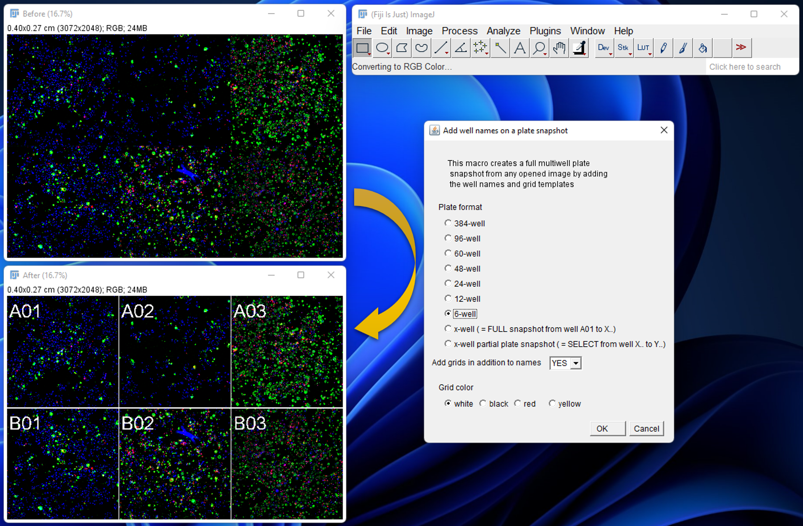
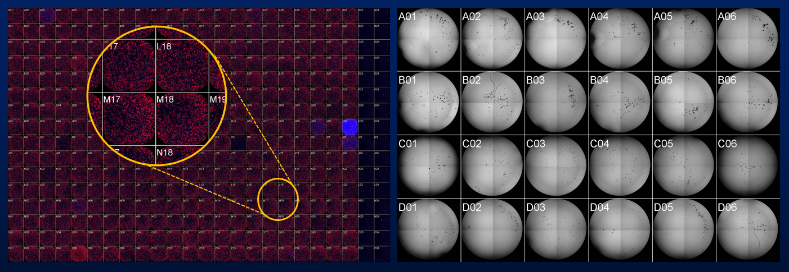

# Grid_addition_snapshot

* This fiji macro adds well labels and grids to any opened image to generate a full multiwell plate snapshot
* Any image can be used (i.e. the result of a montage from stack...)
* Any multiwell plate format can be applied (96-well, 384-well, 6-well, custom...)
* Labels of wells can be applied alone or with the grid templates
## Example: 6 images from a 6-well plate

## Example: full 384-well plate (with zoom) and full 24-well plate 

